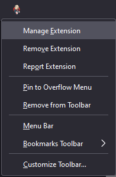
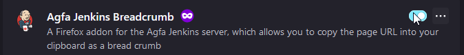
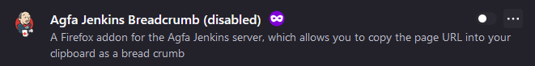
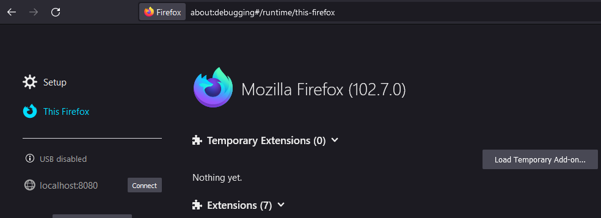
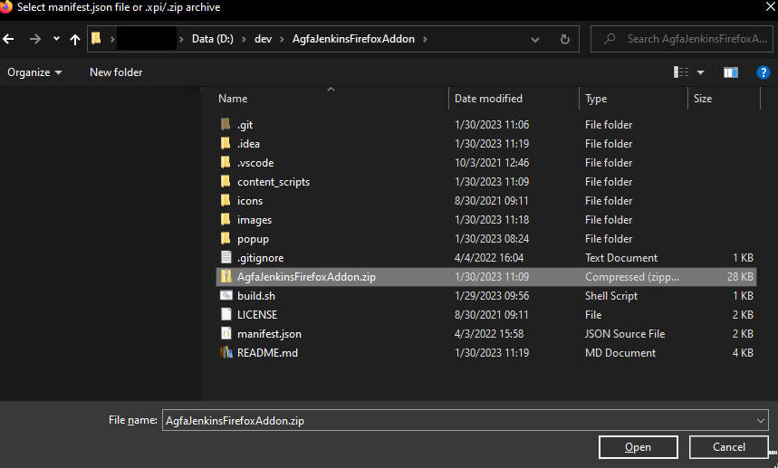

# Agfa Jenkins Firefox Addon

A Firefox addon for the Agfa Jenkins server, which allows you to copy the 
page URL into your clipboard as a bread crumb

For example if the URL is

http://ei-ci.agfahealthcare.com/jenkins/job/ei-topic-sloth-IEI-130528-use-dicomconfig-cache/job/continuous%20pacs%20extended-smoke-tests/lastCompletedBuild/testReport/com.agfa.test.seriesheader/MissingInstancesOnArchiveSeriesheaderTest/missingInstancesInArchive_ShouldReturnSeriesHeaderButNotStoreIt_directSHRead__true__storageGroup_ARCHIVE_TAR__fileNr_3__/

It will convert it to this (and copy it to the clipboard)

[ei-topic-sloth-IEI-130528-use-dicomconfig-cache](http://ei-ci.agfahealthcare.com/jenkins/job/ei-topic-sloth-IEI-130528-use-dicomconfig-cache) > [continuous pacs extended-smoke-tests](http://ei-ci.agfahealthcare.com/jenkins/job/ei-topic-sloth-IEI-130528-use-dicomconfig-cache/job/continuous%20pacs%20extended-smoke-tests) > [lastCompletedBuild](http://ei-ci.agfahealthcare.com/jenkins/job/ei-topic-sloth-IEI-130528-use-dicomconfig-cache/job/continuous%20pacs%20extended-smoke-tests/lastCompletedBuild) > [testReport](http://ei-ci.agfahealthcare.com/jenkins/job/ei-topic-sloth-IEI-130528-use-dicomconfig-cache/job/continuous%20pacs%20extended-smoke-tests/lastCompletedBuild/testReport) > [com.agfa.test.seriesheader](http://ei-ci.agfahealthcare.com/jenkins/job/ei-topic-sloth-IEI-130528-use-dicomconfig-cache/job/continuous%20pacs%20extended-smoke-tests/lastCompletedBuild/testReport/com.agfa.test.seriesheader) > [MissingInstancesOnArchiveSeriesheaderTest](http://ei-ci.agfahealthcare.com/jenkins/job/ei-topic-sloth-IEI-130528-use-dicomconfig-cache/job/continuous%20pacs%20extended-smoke-tests/lastCompletedBuild/testReport/com.agfa.test.seriesheader/MissingInstancesOnArchiveSeriesheaderTest) > [missingInstancesInArchive_ShouldReturnSeriesHeaderButNotStoreIt_directSHRead__true__storageGroup_ARCHIVE_TAR__fileNr_3__](http://ei-ci.agfahealthcare.com/jenkins/job/ei-topic-sloth-IEI-130528-use-dicomconfig-cache/job/continuous%20pacs%20extended-smoke-tests/lastCompletedBuild/testReport/com.agfa.test.seriesheader/MissingInstancesOnArchiveSeriesheaderTest/missingInstancesInArchive_ShouldReturnSeriesHeaderButNotStoreIt_directSHRead__true__storageGroup_ARCHIVE_TAR__fileNr_3__)

It's a much easier format to read and is useful for pasting into Microsoft Teams (using HTML) or a code 
review in Bitbucket/GitHub (as Markdown) or a JIRA issue (in JIRA format)

# Trying Out changes

1. Disable the existing extension you may have installed

   

   then click on the disable toggle

    

   it should look like this when complete

    

2. After you've made your changes to the source code, build the .zip file from the command line by running `./build.sh` from the root directory of the repository
```bash
xxx@xxxx.xxx.com MINGW64 /d/dev/AgfaJenkinsFirefoxAddon (main)
$ ./build.sh

7-Zip 22.01 (x64) : Copyright (c) 1999-2022 Igor Pavlov : 2022-07-15

Scanning the drive:
3 folders, 15 files, 35105 bytes (35 KiB)

Creating archive: AgfaJenkinsFirefoxAddon.zip

Add new data to archive: 3 folders, 15 files, 35105 bytes (35 KiB)


Files read from disk: 15
Archive size: 28553 bytes (28 KiB)
Everything is Ok
```
3. Go to [about:debugging#/runtime/this-firefox](about:debugging#/runtime/this-firefox) in firefox
   
4. Click the `Load Temporary Add-on` icon select the .zip file you generated in step 1.
   
5. Navigate to the webpage for jenkins01-iibu or ei-ci to try out the extension.

> **_Note_** You can use the debugger and console in firefox, just make sure you have the correct log levels set and add 
   breakpoints to watch/inspect the code while debugging.